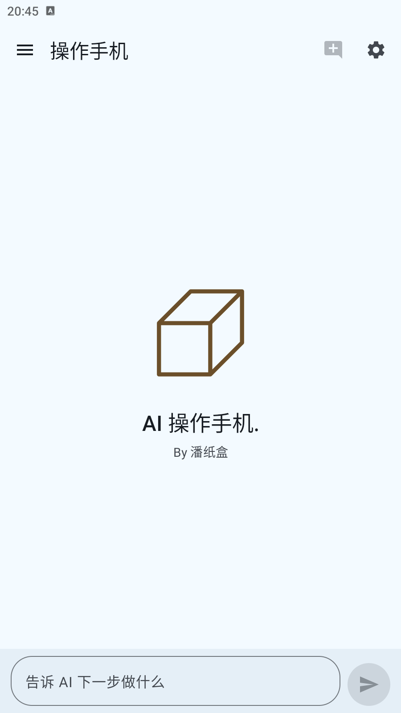
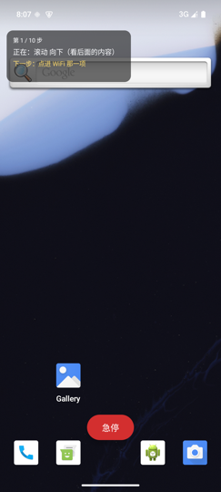
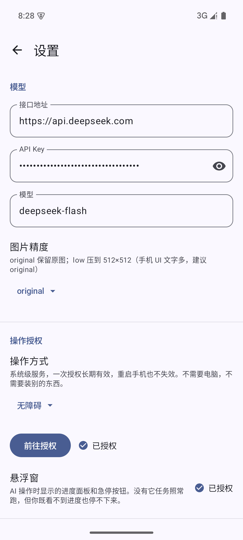

# 纸盒

**让 AI 直接操作你的安卓手机。**

用一句话说清楚你要干什么，它自己看屏幕、点按钮、输入文字，一步步把事做完。

不需要 root，不需要电脑，不需要装 Shizuku 或任何额外组件。
装上一个 APK、开一次无障碍权限、填一个模型 API Key 就能用。

> 名字来自作者「潘纸盒」，图标就是一个纸板箱。

| 主界面 | 悬浮控制面板 | 设置页 |
|---|---|---|
|  |  |  |

---

## 它能做什么

- **听懂人话去操作手机**：「打开 WiFi」「把屏幕亮度调低」「去设置里看看还剩多少存储」
- **不挑应用**：微信、抖音、设置、各类工具类 App 都能点，因为它操作的就是屏幕上真实的东西
- **边做边告诉你下一步**：左上角悬浮窗实时显示"正在做什么"和"接下来打算做什么"，
  觉得不对**随时按急停**，而不是等它做完才发现错了
- **点在哪看得见**：每次操作屏幕对应位置会闪一圈蓝色水波，
  是"点错了"还是"点对了但没反应"，一眼就能分辨
- **自带记忆和技能**：能查手机上装了哪些应用（不用你告诉它包名），
  记得住你上一句话，也能把习惯沉淀成长期记忆
- **完整日志**：每一步做了什么、模型返回了什么原始内容、截图，全部留在本地，可一键导出

## 环境要求

| | |
|---|---|
| 手机 | Android 9（API 28）及以上，建议 Android 11 以上 |
| 模型 | 任意 **OpenAI 兼容** 接口的模型。默认不发送图片，所以纯文本模型也能用 |
| 网络 | 手机能访问你填的模型接口 |
| 电脑 | **不需要**。只有自己编译 APK 时才需要 |

已实测：Android 15 模拟器 + DeepSeek API（`deepseek-flash`）。

## 安装

**方式一：直接装 APK**

到 [Releases](../../releases) 页面下载 APK，装到手机上（首次安装需要在系统里
允许"安装未知来源应用"）。

**方式二：自己编译**

```bash
git clone <repo-url>
cd 纸盒
./gradlew assembleDebug
# 产物：app/build/outputs/apk/debug/app-debug.apk
adb install app/build/outputs/apk/debug/app-debug.apk
```

需要 JDK 17 和 Android SDK 35。用 Android Studio 的话，
`File → Open` 打开项目根目录，等同步完点运行即可。

> ⚠️ **Gradle 用的 JDK 必须是 17～22，不能用 25。**
> Android Studio 2026 自带的 JBR 是 25，而 Gradle 8.9 自带的 Kotlin DSL
> 编译器不认识这个版本号 —— 报错会是一句莫名其妙的 `25.0.3`：
>
> ```
> * What went wrong:
> 25.0.3
> java.lang.IllegalArgumentException: 25.0.3
> ```
>
> 解决：`Settings → Build, Execution, Deployment → Build Tools → Gradle
> → Gradle JDK`，改成 17 或 21 即可。**不需要改代码。**

> **磁盘空间不够时**：构建产物能占几百 MB。Android Studio 在磁盘满的时候
> 表现是"同步失败"，而报错只写 `No space left on device`，看不出是磁盘的问题。
> 清一下即可：`bash tools/clean_build.sh`

## 首次使用：三步

### 1. 填模型配置

打开应用 → 右上角 **⚙** → 「模型」：

| 填什么 | 例子 |
|---|---|
| 接口地址 | `https://api.deepseek.com`（会自动补 `/v1/chat/completions`） |
| API Key | 你的 Key，默认打码显示，点右边的眼睛可以看明文 |
| 模型 | `deepseek-flash` |
| 思考模式 | 滑块四档 OFF / LOW / HIGH / MAX，默认 **OFF**（最快最省）。见下面「思考模式」一节 |

> 只要是 OpenAI 兼容的接口都能填，不限于 DeepSeek。
> 模型支不支持看图都能用 —— 默认流程不发图片，只有它主动要截图时才需要。

### 2. 开无障碍权限

设置页 → 「操作授权」→ **前往授权** → 在系统设置里找到「纸盒」并打开。

无障碍**必须手动去系统设置里开**，任何应用都不能用代码申请，这是安卓的设计。
好处是开一次就行，**重启手机也不会失效**。

### 3. 开悬浮窗权限（强烈建议）

设置页 → 「操作授权」→ 「悬浮窗」→ 去开启，允许「显示在其他应用上层」。

开了之后你才能看到进度和急停按钮。各家手机叫法不同：

| 品牌 | 入口一般叫 |
|---|---|
| 小米 / 红米 | 显示在其他应用上层 |
| 华为 / 荣耀 | 悬浮窗 |
| OPPO / 一加 / realme | 悬浮窗（ColorOS 还可能要额外打开「允许受限制的设置」） |
| vivo / iQOO | 悬浮窗 |
| 原生安卓 | 显示在其他应用的上层 |

## 怎么用

1. 在主界面底部的输入框里写你要它干什么，点发送
2. 应用退到后台，**被操作的应用会自己回到前台** —— 你直接看着它动就行
3. 手机左上角悬浮窗显示：
   - 当前处在哪一段（截图中 / 上传中 / 等待模型 / 正在操作手机 / 等待系统响应）
   - 第几步
   - 正在做什么
   - **下一步打算做什么** ← 最关键的一行，看完觉得不对就急停
4. 想停下来，三种方式任选：
   - 点悬浮窗底部的红色「急停」
   - 下拉通知栏，点通知上的「停止」
   - 回到应用点停止

### 任务怎么写

**从简单的开始。** 第一次别试「帮我订外卖」这种，先试：

```
打开设置
打开 WiFi
把屏幕亮度调到最低
打开设置看看还剩多少存储空间
```

任务**越具体越好**。「帮我处理一下手机」这种它不知道该干嘛。

## 副屏（实验性，需要 Shizuku）

侧边栏 →「副屏」。用 Shizuku 借到 shell 身份，开一块**虚拟屏幕**，
把它的画面搬进应用里显示，并在上面模拟触控 —— 这样 AI 可以在另一块屏上
干活，你还能同时用手机。

**需要先装 [Shizuku](https://shizuku.rikka.app/) 并启动它**（无 root 的设备
用「无线调试」启动，重启后要重新启动一次）。装好之后进副屏页面点
「申请授权」。

### 有一件事必须说清楚

**副屏上的点击做不到用无障碍实现。** 安卓的手势注入接口
（`dispatchGesture`）没有"指定哪块屏幕"的参数，只能作用于主屏。
所以副屏的触控只能走 shell 的 `input -d <屏幕id>` —— 也就是说
**副屏功能必须依赖 Shizuku**，无障碍在这一块帮不上忙。

### 怎么用

副屏是**逐条定时任务自己的选项**（不在设置里）。侧边栏 →「定时任务」→
新建一条时，打开 **在副屏上操作** 那个开关。到点后：

```
建一块虚拟屏  →  切到副屏通道  →  自动弹出镜像窗口  →  AI 在那块屏上干活
                                                    →  任务结束自动撤屏
```

已经建好的任务会在时间前面带一个「· 副屏」标记，一眼能看出哪几条走副屏。

手动在主界面输入框里发的任务**一律走主屏** —— 主屏有控件树，定位比副屏
的"看截图猜坐标"准得多。副屏只留给那种"跑起来就别打扰我"的定时任务。

手机主屏留给你自己用，你可以在镜像窗口里看着 AI 操作。

### 一个必须先自检的点

这套命令（建屏 / `screencap -d` / `input -d`）在不同 ROM 上表现不一样，
**我这边没有真机可验证**。所以副屏页面被做成了一个"按顺序点一遍"的自检流程：

```
1. 创建副屏  →  2. 试截一张  →  3. 试点一下  →  4. 打开副屏窗口
```

每一步都会把**命令的原始输出**摊在下面。哪一步不成立，把那段输出发出来就能定位。

### 副屏模式比主屏弱在哪

| | 主屏（无障碍） | 副屏（Shizuku） |
|---|---|---|
| 控件树 | **有**，模型选编号定位 | **没有**（安卓不给第三方读副屏的无障碍树） |
| 定位方式 | 编号优先，坐标兜底 | 只能看截图给坐标 |
| 中文输入 | `ACTION_SET_TEXT`，随便输 | `input text` 只支持 ASCII，**中文输不了** |
| 重启后 | 自动恢复 | 要重新启动 Shizuku |

所以：**简单流程用副屏，复杂界面留在主屏。** 副屏模式读不到控件树时，
每一步会自动带上截图（没有别的信息来源了），这是它必然的成本。

> 副屏 id 是从 `dumpsys display` 推断出来的（系统没有"我刚建的屏 id 是几"
> 这种查询，各 ROM 格式还不一样）。推断错了的话，页面上可以**手动填 id**。

## 操作记录：把手动操作学成技能

有些操作很固定（发朋友圈、每日打卡）。与其让 AI 每次现想，不如：

1. 侧边栏 →「操作记录」→ **开始录制**
2. 去目标应用里正常操作一遍（左上角悬浮窗会显示录到第几步）
3. 回到应用 → 点 **发给 AI 学习**

AI 会给它起名、写说明、去掉你多点或点错的步骤，存成一个技能。
以后 AI 就能直接调用它 —— **一次调用走完十几步，中间不花任何模型推理**，
比它自己一步步试快得多，也便宜得多。

回放时是按**控件签名**（viewId / 文字）在当前界面上找回同一个按钮再点，
不是硬记坐标。某一步找不到就停下，并把"卡在第几步、前面完成了多少"
交给 AI 让它接着处理 —— 快路走不通就退回慢路，而不是整个任务失败。

> 密码框会被自动跳过：密码既不记录、不落盘，也不会发给模型。

## 定时任务

侧边栏 →「定时任务」→ 写一条任务、选个时间。到点它会提醒你，
并把任务填进主界面自动开跑。可以设成每天重复，也可以只跑一次。

**有一点必须说清楚**：到点时**手机需要是解锁、亮屏状态**，AI 才操作得了 ——
无障碍服务读不到锁屏后面的界面。所以它是"到点提醒你、你看着它干"，
不是半夜无人值守。

两个系统层面的细节已经处理好了：

- **精确闹钟**：Android 14 默认拒绝这个权限，拿不到时只能用不精确的闹钟
  （可能晚几分钟）。页面上会显示当前状态并给一个去授权的入口
- **重启 / 强行停止之后**：闹钟会被系统清空，所以开机时会自动重排；
  应用被强行停止过的话，重新打开一次应用也会自动恢复

## 技能

有些信息不在屏幕上 —— 比如"手机里装了哪些应用"。这类信息它会自己去取，
你不需要告诉它包名：

| 技能 | 干什么 |
|---|---|
| `list_apps` | 列出手机上已安装的应用和包名（所以「打开微信」这类指令不用你查包名） |
| `recall_memory` | 取回之前存下来的记忆（你的偏好、常用应用、踩过的坑） |
| `list_skills` | 查看全部技能的详细说明 |
| `macro_*` | **你自己录制的技能**（见上面「操作记录」） |
| （定时任务） | 到点自动跑一条任务（见上面「定时任务」） |

技能不需要你配置，模型自己会在需要时调用。

## 设置项

### 模型

见上面「首次使用」第 1 步。

**思考模式**单独说一下，因为它直接决定速度和花费（滑块四档，从左到右）：

| 档位 | 行为 |
|---|---|
| **OFF**（默认） | 不推理，直接给动作。最快最省 |
| LOW | 少量推理。速度接近 OFF，复杂界面比 OFF 稳 |
| HIGH | 充分推理。慢一些、贵一些 |
| MAX | 推理拉满。最慢最贵 |

自动化操作大多是「看一眼，决定点哪」，**默认的 OFF 通常又快又够用**；
界面复杂、要绕圈子的时候再往上调。

> 这里没有"什么都不发、让服务端替你决定"的档位 —— DeepSeek 的默认是
> 开着思考且强度 high，那一档用户看不出自己在最贵的位置上。
> 现在界面上显示什么，就是实际发出去的什么。
>
> 这套参数（`thinking` / `reasoning_effort`）是 DeepSeek 的写法。
> 换成别的服务商如果报错，把档位设成 OFF —— 那一档只发 `temperature`，
> 普通模型都认。

### 操作授权

| 项 | 说明 |
|---|---|
| 操作方式 | 目前只有「无障碍」 |
| 无障碍 | 显示「已授权」才算真的开了 |
| 悬浮窗 | 特殊权限，需要手动去系统设置开 |

> 「在副屏上操作」**不在设置里**了 —— 它现在是**定时任务**的逐条选项，
> 见上面「副屏」一节。

### 更多设置

> ⚠️ 这一栏界面上有行红字：**除非你知道这是什么，否则请不要动。**

| 项 | 默认 | 说明 |
|---|---|---|
| 最大步数 | 30 | 滑块，**拉到最右是「不限」**。每步都要调一次模型，所以这个值就是花费上限 |
| 上下文 | 超过 24 小时 | 三档滑块：**每次重置 / 超过 24 小时 / 不限**（见下） |
| 开启记忆 | 关 | 开了就每次任务结束后让 AI 归纳一条记忆（多花一次纯文字调用） |

**上下文这三档怎么选：**

| 档位 | 行为 | 什么时候用 |
|---|---|---|
| 每次重置 | 每发一条新任务就开全新上下文，AI 不记得上一条任务 | 任务之间互不相关，想让每次判断都干净 |
| 超过 24 小时 | 24 小时没动静才清 | 日常用这档：一天之内连着做几件事，AI 记得你说过什么；隔天又从头开始 |
| 不限 | 永远不清，AI 记得这次会话里的每一句话 | 一段长流程要连着做很多步 |
| 保存日志 | 开 | 每次任务写一份完整日志 |
| 保存截图到本地 | 开 | 把截图存进日志目录（默认流程不截图，只有模型要图时才有） |

## 花费

按你用的模型计费。以 DeepSeek 为例，一个十几步的任务通常在**几分钱**量级。

**上下文是怎么接上的：**

- 你看到的对话会存下来，**关掉应用再打开还在**。只有在上下文真的被清掉时
  （按上面的档位、或你手动清空）才会消失，而且会留一条说明告诉你为什么
- **AI 也记得**：上一段对话会原样带进下一条任务，所以「刚才那个」「再点一次」
  这类说法它能听懂
- 为什么带上历史反而更省：服务端按**前缀**复用已算过的内容，重复部分的输入
  单价只有新内容的 1/50。每次都发「上次的 + 新追加」正好整段命中

**记忆是怎么工作的**（想用的话在「更多设置」里打开「开启记忆」）：

- **只增不减**：全部记忆在一个文件（应用私有目录的 `纸盒/memory.md`）里，
  每次任务结束由 AI 归纳一条，**追加到末尾**。不删不改 —— 这样 AI 不会
  把用户纠正过的错误认知又改回去，你也能随时打开文件看完整的来龙去脉
- **只在「新开上下文」时注入**：记忆是在一段上下文**开头**放进系统提示词的，
  之后整段一直用这一份快照。因为系统提示词排在请求的最前面，
  中途改它会让整段上下文的缓存作废
- 所以：**记忆文件新写的内容，要等下次上下文重开才会自动进提示词**。
  想立刻用上，就手动清空一次上下文
- **上下文没重开时**：模型需要就自己调 `recall_memory` 技能拿**最新的**完整版
- 写记忆要调一次模型，几秒钟。这期间你又发了一条任务的话，第二次写入会
  **排队等待**，不会和第一次交错插进同一个文件

**两个省钱旋钮**：

1. **思考模式**（设置 → 模型）。**默认就是最省的 OFF**，不用动它。
   往上调会让每一步都多推理一遍，速度变慢、费用上升 ——
   界面复杂、AI 老走错路的时候再试 HIGH / MAX。
2. **最大步数**就是最坏情况下的花费上限。

**默认不发送图片**也是省钱的关键 —— 一张 1080×2400 的手机截图编码后有一两兆，
如果每一步都发，token 会翻好几倍。只有模型确实看不清界面时才会要一张。

心疼钱就把「最大步数」调小；「上下文缓存命中率」可以在导出的日志里看到。

## 日志与导出

每次任务都会在应用私有目录里生成一份独立记录，**永不覆盖**：

```
run.log          完整文字记录（带时间戳）
report.json      结构化记录：每步的动作 + 模型原始输出
screenshots/     截图（如果有）
```

**导出方式**：设置页 → 保存日志那一栏 → 点导出，走系统分享面板，
可以直接发微信 / 存网盘 / 存到本地。

> Android 11 之后应用私有目录对文件管理器和 USB 都不可见，
> 所以必须走"分享"这条路，不是设计得绕，是系统限制。

遇到问题时，**把导出的 zip 发出来** —— 里面能看到模型每一步的原始输出，
卡在哪里一目了然，比描述半天管用。

## 常见问题

**Q：点了没反应 / 一直找不到按钮**

界面上的元素是自绘的（游戏、地图、部分播放器），系统读不到控件信息。
这时 AI 会主动要一张截图，靠看图来判断位置。

**Q：提示「这个模型不接受图片输入」**

你填的模型是纯文本的，而它恰好需要看一张截图。换个支持图片的模型，
或者在设置里把模型名改成多模态版本。

**Q：银行 / 支付页面操作不了**

这些页面有系统级保护（`FLAG_SECURE`），任何应用都截不到它们的画面。
这是有意为之的安全设计，绕不过去，也不该绕。**建议不要用本应用操作支付类页面。**

**Q：微信 / 支付宝里动作失败或被限制**

主流 App 对自动化操作有风控，被拦是它们的策略，不是本应用的问题。
字节的豆包手机助手最后也主动放弃了这类场景。

**Q：屏幕中途熄灭，然后任务失败**

开着悬浮窗时不会熄屏；关掉悬浮窗的话，长任务中途可能熄屏导致读不到界面。
建议开着悬浮窗，或在系统里把息屏时间调长。

**Q：重启手机后还能用吗**

无障碍权限会保留，重启后依然有效，不用重新授权。

**Q：任务跑飞了停不下来**

点悬浮窗的「急停」，或下拉通知栏点「停止」。急停会在**下一个动作注入之前**生效，
所以最多等一次模型调用的时间（几秒）。等待中的长 sleep 也能被立刻打断。

**Q：国产 ROM 上跑着跑着就没反应了**

部分系统对后台应用管得严。可以做两件事：把「纸盒」加入电池优化白名单，
以及在多任务界面把它锁定。各家设置路径不同，关键词是"电池优化""自启动""后台运行"。

## 隐私

- **API Key 只存在你的手机上**（应用私有目录），除了发给你自己填的模型接口，不会去别处
- **日志和截图只存在本地**，只有你主动点导出、分享出去，才会离开手机
- 屏幕内容会**发送给你配置的模型接口**用于判断下一步 —— 这是它工作的前提，
  请确认你信任所填的服务商
- 应用不包含任何统计、埋点、上报

## 已知限制

| 限制 | 说明 |
|---|---|
| 截不到安全窗口 | 银行 / 支付类页面有系统保护，见上面的常见问题 |
| 截图有频率限制 | 安卓对无障碍截图有限流（约 1 秒一次），代码里做了重试 |
| 自绘界面只能靠坐标 | 游戏、地图这类读不到控件，定位精度会下降 |
| 主流 App 可能风控 | 不是技术问题，见上面的常见问题 |
| 三指以上的自定义手势 | 暂未支持 |

## 免责声明

这是一个**个人自用**的自动化工具。

- 它会**真实地操作你的手机** —— 能点任何东西，包括付款按钮和删除按钮。
  目前**没有**危险动作拦截，请在可控的场景下使用。
- 请确认你有权操作目标设备和目标应用。
- 自动化操作可能违反部分应用的服务条款，由此产生的后果由使用者承担。
- 无障碍是安卓里被监控最严的权限之一，部分应用商店会拒绝上架申请了该权限的应用。

## 许可证

[MIT](LICENSE) © 2026 潘纸盒

## 致谢

**运行时依赖**（均为 Apache-2.0）：[AndroidX](https://developer.android.com/jetpack/androidx) ·
[Jetpack Compose](https://developer.android.com/jetpack/compose) ·
[Kotlin](https://kotlinlang.org/) / [kotlinx.coroutines](https://github.com/Kotlin/kotlinx.coroutines)。
除 AndroidX 之外**没有任何第三方运行时依赖** —— HTTP 用 JDK 自带的
`HttpURLConnection`，JSON 用安卓自带的 `org.json`。

**灵感来源**（未使用其代码）：

- [Roubao（肉包）](https://github.com/Turbo1123/roubao) — MIT，同样是安卓端的 AI 自动化
- [UI-TARS](https://github.com/bytedance/UI-TARS) — Apache-2.0，字节 Seed 的原生 GUI Agent 模型
- [MAA-Meow](https://github.com/Aliothmoon/MAA-Meow) — AGPL-3.0，只研究了架构思路，未参考代码
- [Shizuku](https://github.com/RikkaApps/Shizuku) — Apache-2.0

**模型服务**：默认配置使用 [DeepSeek API](https://platform.deepseek.com/)。
本项目不绑定任何服务商，任何 OpenAI 兼容端点都可以。
